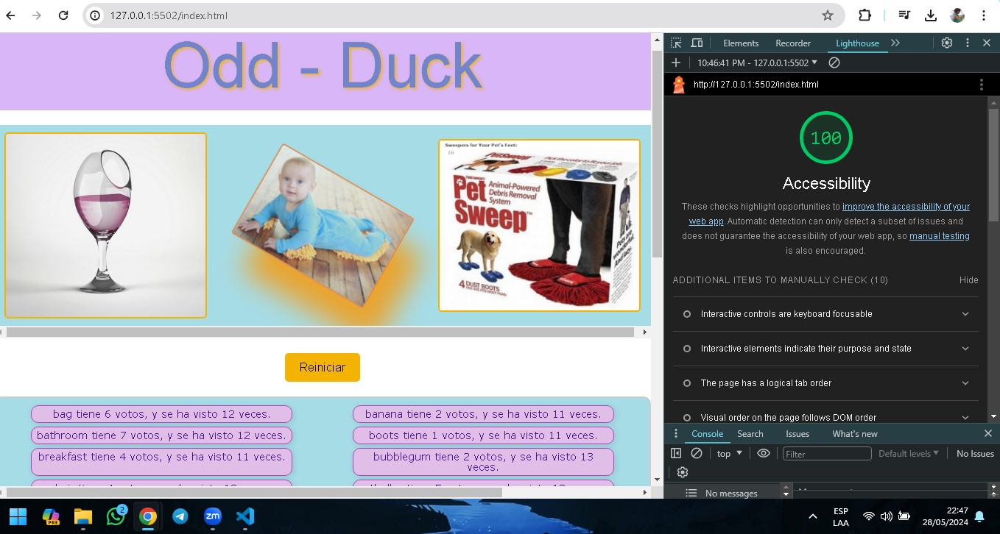

# LABORATORIO - 15 B

## Odd Duck

La aplicacion Odd Duck realiza una encuesta interactiva sobre una serie de productos. Los usuarios pueden seleccionar sus productos favoritos entre tres opciones mostradas aleatoriamente en cada ronda. Después de completar las 25 rondas, pueden ver los resultados de la encuesta y un gráfico que muestra cuántas veces se ha mostrado y seleccionado cada producto. La aplicación utiliza HTML, CSS y JavaScript para proporcionar una experiencia de usuario interactiva y visualmente atractiva.

### Autor: Omar Alexis Torbisco Pizarro

### Enlaces y Recursos

* [Repositorio Odd-Duck](https://github.com/omartpiza/odd-duck)

* [Pagina Odd-Duck](https://omartpiza.github.io/odd-duck)

### Puntuación de Accesibilidad de Lighthouse

* 

### Reflexiones y Comentarios

1. ¿Cómo te fue, en general?
- Fue mas sencillo ya que tenia casi toda la aplicacion resuelta solo tuve que hacer algunos cambios en estilos para mejorarla
2. ¿Qué observaciones o preguntas tienes acerca de lo que hemos aprendido hasta ahora?
- Quisiera saber de que otra forma lo hicieron mis compañeros y ademas, cual es la forma por dafault como se haria normalamente si fuese ya un experto.
3. ¿Cuánto tiempo te tomó terminar esta tarea?
- me tomo un aprox de 1:30h.
4. Y, antes de que comenzaras, ¿cuánto tiempo creiste que te tomaría terminar esta tarea?
- crei que me tomaria 1h.