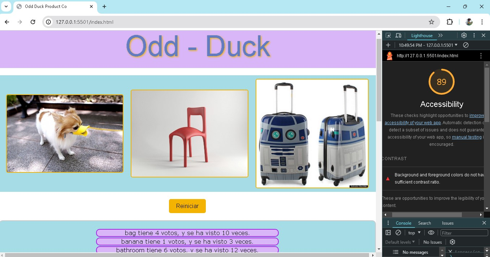

# LABORATORIO - 13

## Odd Duck

¡Hola! Soy Omar Torbisco y me desempeño en el rubro de branding y publicidad. Además, cuento con conocimientos en arquitectura e ingeniería civil. Utilizo Windows 10 Home como mi sistema operativo.
Estoy emocionado por esta clase porque deseo mejorar mis habilidades en HTML y CSS, y también ampliar mis conocimientos en JavaScript. Creo que estas habilidades son esenciales para mi desarrollo profesional y estoy entusiasmado por aprender más para conocer las muchas ramas que tiene la programación. ¡Estoy listo para sumergirme en el aprendizaje y crecer profesionalmente!

### Autor: Omar Alexis Torbisco Pizarro

### Enlaces y Recursos

* [Repositorio Odd-Duck](https://github.com/omartpiza/odd-duck)

* [Pagina Odd-Duck](https://omartpiza.github.io/odd-duck)

### Puntuación de Accesibilidad de Lighthouse

* 

### Reflexiones y Comentarios

1. ¿Cómo te fue, en general?
- Fue mas sencillo porque mi me facilito el local storage.
2. ¿Qué observaciones o preguntas tienes acerca de lo que hemos aprendido hasta ahora?
- Quisiera saber de que otra forma lo hicieron mis compañeros y ademas, cual es la forma por dafault como se haria normalamente si fuese ya un experto.
3. ¿Cuánto tiempo te tomó terminar esta tarea?
- me tomo un aprox de 1:30h.
4. Y, antes de que comenzaras, ¿cuánto tiempo creiste que te tomaría terminar esta tarea?
- crei que me tomaria 2h o mas